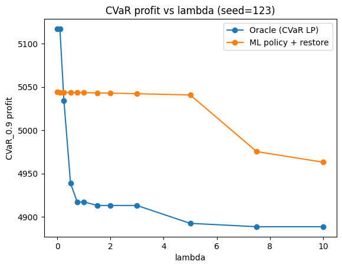
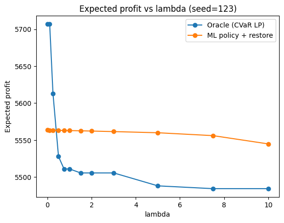

# AI-Assisted Risk-Aware Refinery Planning Optimization

This project implements a **risk-aware refinery planning model** under correlated uncertainty and builds a **machine learning surrogate policy** that approximates optimal CVaR decisions.

It combines:

- Deterministic refinery LP (PIMS-style)
- Monte Carlo scenario generation (correlated market & operational shocks)
- Extensive-form CVaR optimization
- ML-based policy approximation
- Feasibility restoration LP
- Out-of-sample economic validation
- Efficient frontier replication

---

## 🔥 Key Result

A distribution-aware ML surrogate approximates CVaR refinery planning decisions with:

- Median profit gap ≈ 0  
- Mean expected profit gap ≈ −1.89M  
- Catastrophic cases (< −1e6 gap): 7.7%  
- ~2.8× speed improvement vs full CVaR solve (including recourse evaluation)

---

# 1. Deterministic Refinery Model

Implemented in `src/model.py`.

Features:

- Multi-crude slate optimization  
- CDU yields to cuts  
- FCC (gasoline/diesel modes)  
- VR, HC, REF, HDT  
- Hydrogen balance  
- Gasoline & diesel blending with linear quality constraints  
  - Gasoline: RON / RVP  
  - Diesel: sulfur / cetane  
- Two markets (Local / Export)  
- Contracted and spot imports  

Solved using SciPy HiGHS.

---

# 2. Stochastic Scenario Generation

Implemented in `src/scenarios.py`.

Scenario sets include:

- Correlated product netback shocks  
- Crude cost shocks  
- Hydrogen availability & cost shocks  
- Optional spot import capacity disruption  
- Tail overweighting  

Each scenario produces a full LP parameter set.

---

# 3. CVaR Risk Model

Implemented in `src/cvar.py`.

The model solves:

    minimize  E[L] + λ * CVaR_α(L)

Where:

- L = -profit  
- Non-anticipativity enforced on:
  - Crude slate  
  - Unit throughputs  
  - Contracted imports  

Efficient frontiers are computed across λ values.

---

# 4. ML Policy Approximation

Goal:

    (Scenario distribution features, λ)
    → Optimal first-stage policy

### Features

- Netback multiplier statistics (mean/std/quantiles)  
- Crude cost multipliers  
- Hydrogen shocks  
- Spot disruption indicators  
- Risk aversion parameter λ  

### Targets

- Crude runs  
- Unit throughputs  
- Contracted imports  

### Feasibility Restoration

Predicted policies are projected and restored via a linear program to guarantee feasibility before economic evaluation.

---

# 5. Out-of-Sample Evaluation

Evaluation performed on **600 held-out scenario sets** (25% test split).

### ElasticNet Surrogate Performance

| Metric | Value |
|--------|--------|
| Mean expected profit gap | ~ −1.89M |
| Mean CVaR profit gap | ~ −2.09M |
| Median expected profit gap | ~ −25 |
| Catastrophic rate (< −1e6) | 7.7% |
| Avg CVaR solve time | ~1.69 s |
| ML policy + restore time | ~0.60 s |
| Speedup | ~2.8× |

The ML surrogate closely matches oracle performance in moderate risk regimes and diverges mainly at extreme λ values.

---

# 6. Frontier Replication Example

Place these images in:

    docs/images/

### Efficient Frontier (Expected vs CVaR Profit)

### CVaR vs λ

### Expected Profit vs λ

---

# 7. Reproducibility

Install dependencies:

    pip install -r requirements.txt

Generate dataset:

    python -m scripts.make_dataset --n_sets 200 --n_scenarios 75

Train ML policy:

    python -m scripts.train_policy --data_path data/ml/train.parquet --meta_path data/ml/meta.json

Evaluate policy:

    python -m scripts.eval_policy --model_path outputs/models/policy_enet.joblib

Plot frontier comparison:

    python -m scripts.plot_frontier_compare --seed 123 --n_scenarios 75

---

# 8. Project Structure

    src/
      model.py
      scenarios.py
      cvar.py
      oracle.py
      ml/
        features.py
        projection.py
        restore.py

    scripts/
      make_dataset.py
      train_policy.py
      eval_policy.py
      plot_frontier_compare.py

---

# 9. Key Contributions

- Full CVaR refinery planning model  
- Correlated stochastic scenario engine  
- Distribution-aware ML surrogate  
- Feasibility restoration layer  
- Out-of-sample economic validation  
- Efficient frontier replication  
- Quantified speed-performance tradeoff  
